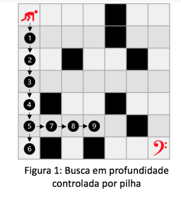

<h1># DFS (depth-first search): Implementação em C</h1>

 

 
</a> 

 

 

O DFS ou Busca em Profundidade é um algoritmo que percorre uma matriz nxn, desde o ponto inicial (0,0) até o ponto final (n,n), aprofundando totalmente em uma linha ou coluna, até que se chegue em uma barreira. Caso o algoritmo bata em alguma posição inválida ele tenta retornar uma posição e seguir outro caminho em profundidade por uma linha ou coluna, até que se encontre a posição final do labirinto.

 

	 

    Observando a figura acima, conseguimos observar o funcionamento do DFS, visto que ele inicia percorrendo a primeira coluna e quando bate na borda volta para tentar seguir caminho pela penultima linha.

    

    Esse algritmo usará da estrutura de pilha dinâmica para percorrer o labirinto. Essa que por sua vez funciona com um ponteiro apontando para o topo e outro para o fundo da estrutura, e os dados vão sendo empilhados na pilha.
    

    

    É possível observar o funcionamento da pilha pela imagem a seguir:
    

    

         
    

     
    

    Explicado o básico das estruturas vamos ao funcionamento do código.
    

    
<h1># Algoritmo</h1>
    

     
    

    O algoritmo usa de uma matriz onde:
        <ul>
            <li>Posição válida = 0;</li>
            <li>Posição inválida = #;</li>
        </ul>
    Usando a estrutura de pilha, ele percorre o labirinto, iniciando no ponto (0,0), de forma que percorra um caminho em profundidade em uma linha ou coluna até que chegue em uma barreira. Após chegar em uma posição inválida ele retorna uma posição e tenta caminhar direto em outra linha ou coluna, em direção ao fim do labirinto. As posições são armazenadas gerando uma única pilha e retornando a quantidade de posições que foram necessárias para percorrer o labirinto.
    

    
<h1># Compilação e Execução</h1>
    

     
    
    O algoritmo disponibilizado possui um arquivo Makefile que realiza todo o procedimento de compilação e execução. Para tanto, temos as seguintes diretrizes de execução:
 
     
    <body>
        <table border="1px" align="center">
            <tr >
                <td align="center"><h3>Comando</h3></td>
                <td align="center"><h3>Função</h3></td>
            </tr>
            <tr>
                <td>make clean</td>
                <td>Apaga a última compilação realizada contida na pasta build</td>
            </tr>
            <tr>
                <td>make</td>
                <td>Executa a compilação do programa utilizando o gcc, e o resultado vai para a pasta build</td>
            </tr>
            <tr>
                <td>make run</td>
                <td>Executa o programa da pasta build após a realização da compilação</td>
            </tr>
        </table>
    </body>
     
    

    